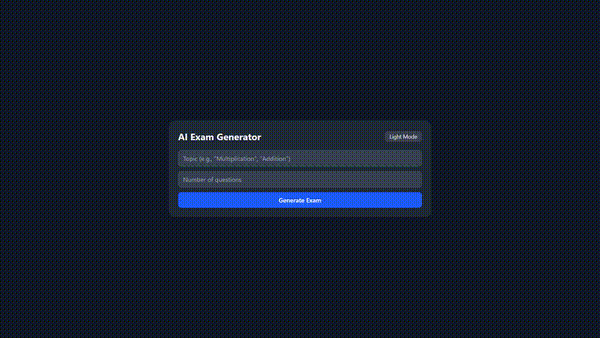

# AI Exam Paper Generator

A full-stack web application that generates customized exam papers using AI.  
Built with **React + Vite + Tailwind CSS (frontend)**, **Node.js + Express (backend)**, and integrated with **Gemini AI API** for intelligent paper generation.  

---

### Live Link  
👉 [View Live Project](https://ai-exam-paper-generator.onrender.com)  

---

## 🎥 Demo Video

[](./assets/demo.mp4)

---

## 🚀 Features
- Generate exam papers based on subject, topic, and difficulty.  
- Customizable number of questions and paper format.  
- AI-powered question creation using **Gemini API**.  
- Full-stack architecture with separate **frontend** and **backend**.  
- Production-ready deployment support (Render).  

---

## 🛠️ Tech Stack
- **Frontend**: React, Vite, TailwindCSS  
- **Backend**: Node.js, Express.js  
- **AI Integration**: Gemini API  
- **Hosting**: Render  
- **Version Control**: Git & GitHub  

---

## 📂 Project Structure
```
AI-Exam-Paper-Generator/
│
├── exam-frontend/ # React frontend
├── exam-backend/ # Express backend
├── assets/ # demo video
├── .gitignore
├── .env.example # Example environment variables
└── README.md
```
---

## ⚙️ Setup Instructions  

### 1. Clone the repo  
```bash
git clone https://github.com/MohitMehtre/AI-Exam-Paper-Generator.git
cd AI-Exam-Paper-Generator
```

### 2. Install dependencies
```bash
cd exam-frontend && npm install
cd ../exam-backend && npm install
```

### 3. Environment variables

Create a .env file inside the exam-backend/ folder (not committed to git).
```env
GEMINI_API_KEY=your_api_key
FRONTEND_URL=http://localhost:5173
```
**Note:** If you’re only running a single Vite frontend on your system, the default link will usually be http://localhost:5173. When you start the frontend with npm run dev, the exact link will be shown in your terminal. After confirming it, use that link as the value of FRONTEND_URL in your .env file.

For production, set FRONTEND_URL to your deployed frontend link.
PORT is automatically managed by hosting platforms (you don’t need to set it).

### 4. Run the app locally
Backend
```bash
cd exam-backend
npm start
```
Frontend
```bash
cd exam-frontend
npm run dev
```

App runs at:

- **Frontend** → http://localhost:5173  
- **Backend** → http://localhost:5000  

> 💡 **Note:** If you want to confirm that the backend is running correctly, you can uncomment the line  
> ```js
> console.log(`Server running on http://localhost:${PORT}`);
> ```  
> inside **server.js** before starting the server.  
> The link will then be shown directly in the terminal when you run the backend.


---

## 📝 License
This project is licensed under the MIT License.

---
